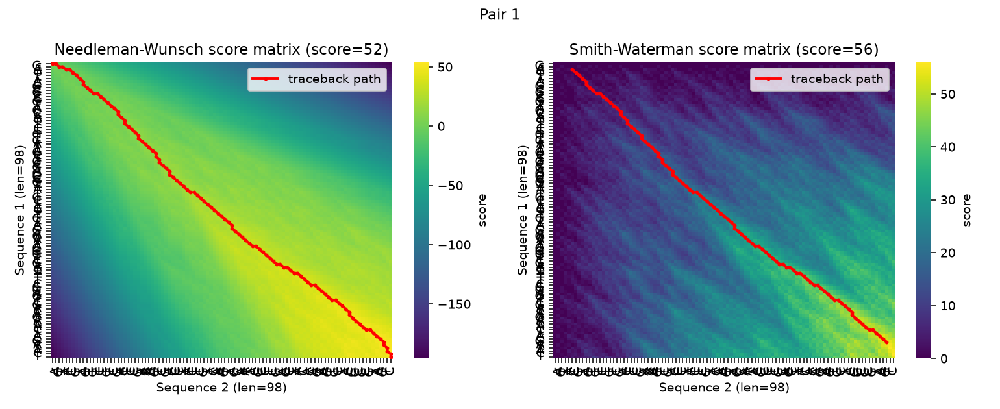
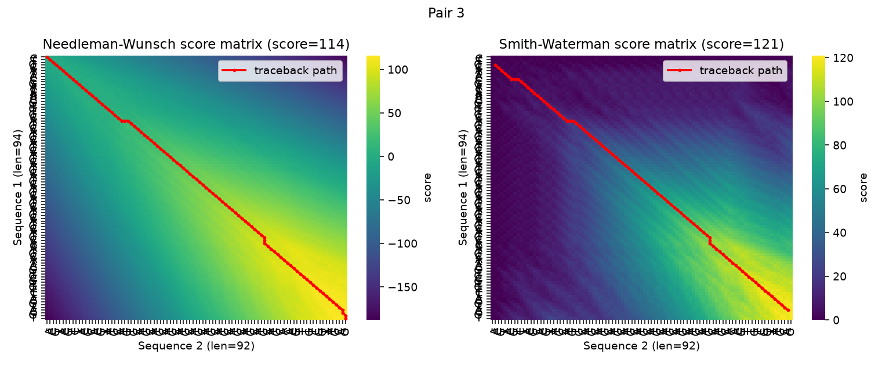

# 1. Description of the algorithms

Both Needleman-Wunsch (global alignment) and Smith-Waterman (local
alignment) were implemented from scratch in `alignment.py` using numpy for
the dynamic-programming score matrix and an explicit traceback matrix. They
share the same recurrence for filling cell $(i, j)$, comparing character
$a_i$ of sequence 1 against character $b_j$ of sequence 2:

- **Diagonal move**: `score[i-1][j-1] + s(a_i, b_j)`, where `s` is +2 for a
  match and -1 for a mismatch — align $a_i$ with $b_j$.
- **Up move**: `score[i-1][j] + gap`, where `gap = -2` — align $a_i$ with a
  gap.
- **Left move**: `score[i][j-1] + gap` — align $b_j$ with a gap.

`score[i][j]` is the max of the three (Needleman-Wunsch) or the max of the
three and 0 (Smith-Waterman).

**Needleman-Wunsch (global).** Row 0 and column 0 are initialized with
cumulative gap penalties (`0, -2, -4, -6, ...`), which forces the alignment
to explain every character of both sequences from end to end. Traceback
always starts at the bottom-right corner `(n, m)` and follows the recorded
pointer (diagonal/up/left) back to `(0, 0)`.

**Smith-Waterman (local).** Every cell is additionally floored at 0 — a
negative running score simply "resets," allowing an alignment to start
fresh anywhere in the matrix. The single highest-scoring cell in the whole
matrix is tracked while filling it; traceback starts there and walks
backwards until it reaches a cell whose value is 0, recovering only the
best-scoring local region rather than the full sequences.

This distinction (boundary conditions + traceback origin) is the *only*
structural difference between the two algorithms — everything else
(recurrence, complexity, implementation shape) is identical, which is why
`alignment.py` implements them side by side with a shared substitution
function.

Both algorithms run in $O(nm)$ time and space, where $n$ and $m$ are the
lengths of the two input sequences.

# 2. Discussion of alignment outputs

All 10 DNA pairs from the assignment handout were aligned with both
algorithms using the required scoring scheme (match +2, mismatch -1,
gap -2). Full results are in `results/scores_summary.csv` and the complete
aligned sequences (with `|`/`.`/space match lines) are in
`results/alignments.txt`.

| Pair | len(seq1) | len(seq2) | NW score | NW identity | SW score | SW identity | SW local length |
|-----:|----------:|----------:|---------:|------------:|---------:|------------:|-----------------:|
| 1  | 98 | 98 |  52 | 72.1% |  56 | 70.7% | 100 |
| 2  | 97 | 93 |  49 | 72.3% |  56 | 82.5% |  71 |
| 3  | 94 | 92 | 114 | 80.0% | 121 | 84.9% |  92 |
| 4  | 94 | 89 |  60 | 67.1% |  66 | 72.8% |  96 |
| 5  | 95 | 84 | 140 | 97.6% | 155 | 96.4% |  84 |
| 6  | 91 | 79 | 131 | 98.7% | 149 | 98.7% |  80 |
| 7  | 92 | 88 |  51 | 80.3% |  79 | 80.3% |  90 |
| 8  | 90 | 85 |  76 | 75.3% | 111 | 98.3% |  57 |
| 9  | 94 | 90 | 163 | 96.7% | 163 | 96.7% |  94 |
| 10 | 94 | 86 | 144 | 95.3% | 154 | 100.0% | 81 |

Two patterns stand out:

- **Smith-Waterman's score is always $\geq$ Needleman-Wunsch's** for the
  same pair. This is expected: local alignment is a relaxation of global
  alignment — it is always free to align the *entire* sequences (matching
  Needleman-Wunsch's score) but can instead choose to discard low-scoring
  flanking regions if that raises the score, which it does for every pair
  here.
- **Highly repetitive pairs (5, 6, 9, 10)** — built from `AGCT`/`ACGT`
  tandem repeats — reach very high identity (95–100%) under both
  algorithms, since almost every position aligns trivially against the
  repeating motif. **Low-complexity but less regular pairs (1, 2, 4)**
  score much lower, with Smith-Waterman gaining the most relative to
  Needleman-Wunsch by trimming down to a shorter, cleaner local match
  (e.g. pair 8: local length 57 out of 90, but identity jumps from 75.3%
  to 98.3%).

## Score-matrix heatmaps

Figure 1 shows the score matrix for **Pair 1** (a comparatively
low-similarity pair) under both algorithms (left: Needleman-Wunsch, right:
Smith-Waterman), with the traceback path overlaid in red.

{width=95%}

The Needleman-Wunsch path runs from the top-left corner to the
bottom-right corner of the matrix, since it must explain every character of
both sequences. The Smith-Waterman path is visibly shorter and sits
entirely inside a region of positive (green/yellow) score — it starts and
ends wherever the locally optimal region happens to be, ignoring the
dark-blue (negative-score) flanking regions that Needleman-Wunsch is forced
to cross.

Figure 2 shows the same comparison for **Pair 3**, which contains long
`GCAT` tandem repeats: both matrices show a broad, bright diagonal "band"
(many equally-good near-diagonal paths caused by the repeat structure),
and the traceback follows one of several near-optimal routes through it.

{width=95%}

## Aligned sequences

An example block from `results/alignments.txt` (Pair 1, Needleman-Wunsch,
score 52) — `|` marks a match, `.` a mismatch, and a blank marks a gap:

```
-G-A-CTTACGCG-CCGTAGCACTTCTGTGATAGCTGCGAGGCGTAT-TGCTACTTGTAC
 | | |.|| |.| |.||.| || ||.| .|.|| | ||| .|.||| |..|||..||| 
AGTATCGTA-GTGTCTGTCG-AC-TCCG-AAAAG-T-CGA-CCCTATCTCGTACAAGTA-
```

The corresponding Smith-Waterman local alignment for the same pair (score
56) trims the low-scoring first two columns and the low-scoring tail,
keeping only the higher-identity core region (`seq1[2:93]` vs
`seq2[5:96]`). Every pair's full global and local alignment, in this same
format, is available in `results/alignments.txt`.

# 3. Analysis of parameter effects (Part 3)

Three pairs with different structure were selected for the sensitivity
study: **Pair 1** (dissimilar, close to random), **Pair 3** (`GCAT` tandem
repeats), and **Pair 7** (palindromic, low-complexity `CG`/`AT` runs). Each
was re-aligned under four scoring schemes:

| Scheme             | match | mismatch | gap |
|---------------------|------:|---------:|----:|
| `default`           |    +2 |       -1 |  -2 |
| `harsh_gap`         |    +2 |       -1 |  -6 |
| `lenient_mismatch`  |    +2 |        0 |  -2 |
| `strict_mismatch`   |    +1 |       -3 |  -2 |

Selected results (full table in `results/parameter_sensitivity.csv`):

| Pair | Scheme            | NW score | NW gaps | SW score | SW local length |
|-----:|-------------------|---------:|--------:|---------:|-----------------:|
| 1 | default           |  52 | 24 |  56 | 100 |
| 1 | harsh_gap         |   6 |  4 |  28 |  38 |
| 1 | lenient_mismatch  |  80 |  8 |  84 | 100 |
| 1 | strict_mismatch   | -52 | 28 |   7 |   7 |
| 3 | default           | 114 |  6 | 121 |  92 |
| 3 | harsh_gap         |  90 |  6 | 106 |  56 |
| 3 | lenient_mismatch  | 132 |  6 | 134 |  91 |
| 3 | strict_mismatch   |  23 | 20 |  52 |  52 |
| 7 | default           |  51 | 28 |  79 |  90 |
| 7 | harsh_gap         |  -1 |  4 |  46 |  49 |
| 7 | lenient_mismatch  |  74 | 10 |  96 |  87 |
| 7 | strict_mismatch   | -37 | 30 |  13 |  16 |

**`harsh_gap` (gap -2 → -6).** Scores drop for every pair, and the number
of gaps opened collapses (e.g. Pair 1: 24 → 4 gaps). With indels made far
more expensive, the optimizer switches strategy: instead of opening gaps to
re-synchronize shifted repeats, it prefers to align positions directly and
simply accept more mismatches. For Smith-Waterman this also shrinks the
local region considerably (Pair 3: local length 92 → 56; Pair 1: 100 → 38),
since a marginal gap-containing extension that used to be worth including
no longer pays for itself.

**`lenient_mismatch` (mismatch -1 → 0).** Scores rise across the board,
most dramatically for the low-identity pairs (Pair 1: 52 → 80; Pair 7:
51 → 74), since mismatches become free and the aligner no longer needs to
detour around them with gaps — gap counts drop or stay flat everywhere.

**`strict_mismatch` (match +1 / mismatch -3, gap unchanged).** This scheme
sharply increases the *relative* cost of a mismatch versus a gap ($-3$ vs
$-2$, compared to $-1$ vs $-2$ by default), so alignments swing hard toward
opening more gaps to avoid mismatches — gap counts roughly double or
triple (Pair 1: 24 → 28; Pair 7: 28 → 30; Pair 3: 6 → 20) and
Needleman-Wunsch's global score can even turn negative (Pair 1: -52,
Pair 7: -37), since match reward is halved while mismatch punishment
triples. Smith-Waterman reacts by shrinking its local region drastically
(Pair 1: 100 → 7; Pair 7: 90 → 16) — with mismatches this costly, it is
cheaper to end the local alignment the moment identity dips rather than
cross it, which pushes the reported "local identity" up to 100% at the
expense of alignment length.

**Overall**, the ratio between the gap penalty and the mismatch penalty is
the single parameter that most changes alignment *shape* (gaps vs.
mismatches), while the match reward mostly sets the ceiling on how high a
high-identity region's score can climb. Smith-Waterman is consistently more
sensitive to these changes than Needleman-Wunsch, because it can react by
resizing its local window instead of being forced to keep aligning the
entire sequence.

# 4. Comparison with Biopython (Part 4, bonus)

Both implementations were validated against Biopython's
`Bio.Align.PairwiseAligner` (global and local mode) configured with the
identical scoring scheme (match +2, mismatch -1, gap open/extend -2), run
on all 10 pairs. Full data in `results/biopython_comparison.csv`.

**Correctness.** Every one of the 20 comparisons (10 pairs × 2 modes)
produced an identical optimal score between our from-scratch
implementation and Biopython — strong evidence that both the
Needleman-Wunsch and Smith-Waterman implementations are correct.

**Performance.** Biopython's aligner (implemented in C) is on average
roughly two orders of magnitude faster than our pure-Python/numpy nested
loops on these sequence lengths (~80–100 bp). This gap is expected: our
implementation prioritizes an explicit, inspectable score + traceback
matrix (needed for the heatmap visualizations in Section 2) over raw
throughput, while Biopython's aligner is a compiled, production-grade
implementation with no such introspection overhead. For the sequence
lengths used in this assignment the absolute runtime of both approaches is
well under a second, so the difference has no practical impact here — it
would only matter at genome scale.

# Conclusion

Needleman-Wunsch and Smith-Waterman were implemented from scratch from a
shared dynamic-programming recurrence, differing only in boundary
initialization and traceback origin. Across all 10 provided DNA pairs,
Smith-Waterman's score is never lower than Needleman-Wunsch's, as expected
from the local-vs-global relationship between the two problems. Scoring
parameters substantially reshape the resulting alignments — chiefly by
changing the balance between gaps and mismatches — with Smith-Waterman
consistently more reactive to these changes since it can resize its local
window rather than being forced to span the full sequence. Both
implementations were validated end-to-end against Biopython's
`PairwiseAligner`, matching its optimal score on every pair tested.
