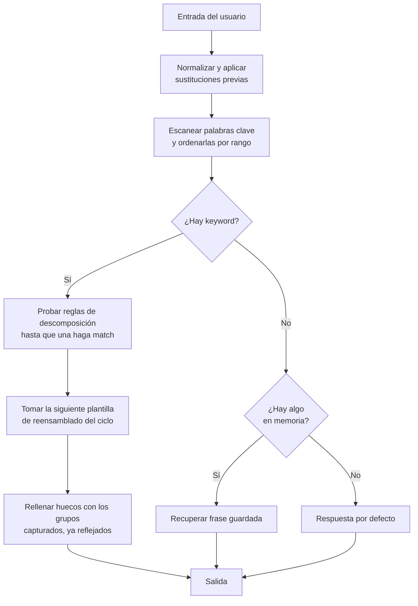

# Tarea 1: ELIZA Mini-Lab

**Curso:** Minería de Textos
**Autor:** Lambda Remiel Heredia Pérez
**Fecha:** 26/08/2026
**Actividades elegidas:** B (Prompt swap), C (Sonda de ambigüedad), E (Modo trace)

---

## 1. Cómo ELIZA crea la ilusión de comprensión

ELIZA no analiza significado. Cada turno pasa por un ciclo fijo de cinco pasos sobre la forma superficial del texto:



La ilusión viene de tres mecanismos baratos:

1. **Reflexión pronominal.** Un intercambio bidireccional (`I` ↔ `you`, `my` ↔ `your`, `me` ↔ `you`) convierte la afirmación del usuario en algo que suena como una pregunta dirigida a él.
2. **Reciclado de contenido.** Los comodines de la descomposición capturan las palabras del propio usuario y las plantillas las devuelven intactas. El programa nunca genera contenido nuevo, solo lo reencuadra.
3. **El encuadre rogeriano.** El guion DOCTOR imita a un terapeuta que por método no aporta información. Es el único dominio conversacional donde no saber nada es coherente con el rol. Weizenbaum eligió ese guion precisamente porque hace invisible la ignorancia del sistema.

> **Nota de diseño:** ELIZA es un intérprete de reglas, el guion DOCTOR son datos. Weizenbaum separó motor y guion explícitamente. Esta distinción se pierde en la mayoría de los ports de clase y es la parte realmente interesante de su arquitectura.

---

## 2. Actividad B: Prompt swap

> Demo usado: ELIZA Archaeology, "Try ELIZA" (implementación de Ant & Max Hay, 2023, guion DOCTOR 1966 original)
> Fecha de captura: [fecha]

Para cada entrada: la respuesta real capturada, y la regla que hipotetizo que disparó.

### B.1 — "I am unhappy."

```
HOW DO YOU DO. PLEASE TELL ME YOUR PROBLEM

I am unhappy.
I AM SORRY TO HEAR YOU ARE UNHAPPY

Why are you sorry?
WHY DO YOU ASK

I don't think you are an actual therapist
WHAT MAKES YOU THINK I AM AN ACTUAL THERAPIST
```

**Keyword hipotetizada:** `I` (rango bajo, es la regla más general del guion)
**Descomposición:** `(0 I am 0)`
**Reensamblado esperado:** uno del ciclo `"Did you come to me because you are (4)?"` / `"How long have you been (4)?"` / `"Do you believe it is normal to be (4)?"`

**Por qué:** el comodín captura la palabra del usuario y la devuelve intacta, eso es lo que la hace sentir pertinente.

**¿Coincidió?** Parcialmente. El mecanismo que predije (capturar la palabra y devolverla intacta) es correcto, pero la keyword específica no fue `I` sino `unhappy` directamente. En el guion DOCTOR original, palabras como `sad`, `unhappy`, `depressed` y `sick` forman una clase de equivalencia propia con rango más alto que el pronombre `I`, y disparan la plantilla fija `"I AM SORRY TO HEAR YOU ARE (1)"`. Es el mismo caso que B.2: una keyword de contenido le gana a una keyword gramatical genérica.

Bonus interesante en el mismo hilo: `"Why are you sorry?"` no encontró ninguna keyword de contenido (no hay `mother`, `sad`, etc. en esa frase) y cayó en una respuesta genérica para preguntas con `why`, `"WHY DO YOU ASK"`. Y `"I don't think you are an actual therapist"` confirma el patrón `(0 you are 0)` con reflexión perfecta: `you are` a `I am`, y el comodín capturó `an actual therapist` sin tocarlo.

---

### B.2 — "My mother takes care of me."

```
HOW DO YOU DO. PLEASE TELL ME YOUR PROBLEM

My mother takes care of me.
TELL ME MORE ABOUT YOUR FAMILY

My brother is at work
WHO ELSE IN YOUR FAMILY IS AT WORK

My father
YOUR FATHER

He is a lawyer
I AM NOT SURE I UNDERSTAND YOU FULLY
```

**Keyword hipotetizada:** `mother`, no `my`. En el guion DOCTOR, `mother` pertenece a la clase de equivalencia de `family` y tiene rango alto, precisamente para ganarle a reglas más genéricas.
**Descomposición:** `(0)`, o sea acepta cualquier cosa
**Reensamblado esperado:** algo de la forma `"Tell me more about your family."`

**Por qué:** hay dos keywords compitiendo, `my` y `mother`. Gana `mother` por rango más alto, y ELIZA descarta el resto de la frase para saltar al tema de familia.

**¿Coincidió?** Sí, exacto.

Lo más rico de este hilo son los tres turnos siguientes, que no estaban en el guion original de la tarea pero salieron solos:

- `"My brother is at work"` sí conserva contenido: `"WHO ELSE IN YOUR FAMILY IS AT WORK"` reutiliza `at work` capturado por comodín. Aquí se ve la descomposición y el reensamblado trabajando juntos, no solo una plantilla fija.
- `"My father"` con solo dos palabras dispara la reflexión más simple posible, `my` a `your`, sin ninguna plantilla elaborada: `"YOUR FATHER"`.
- `"He is a lawyer"` no contiene ninguna keyword del guion (`he` no está en la tabla de reflexión ni es keyword de contenido) y cae directo al default: `"I AM NOT SURE I UNDERSTAND YOU FULLY"`. Este turno es evidencia útil para la actividad C, confirma que la cobertura de pronombres de tercera persona es nula.

---

### B.3 — "Because I am tired."

```
HOW DO YOU DO. PLEASE TELL ME YOUR PROBLEM

Because I am tired.
IS THAT THE REAL REASON

I think so
YOU SAY YOU THINK SO

I do
CAN YOU ELABORATE ON THAT

Well I think I work too much
DO YOU REALLY THINK SO

Yes, I sleep very poorly
YOU SEEM QUITE POSITIVE

Well I'm self aware
IS IT BECAUSE YOU ARE SELF AWARE THAT YOU CAME TO ME

It may be
I AM NOT SURE I UNDERSTAND YOU FULLY
```

**Keyword hipotetizada:** `because`
**Descomposición:** `(0)`
**Reensamblado esperado:** `"Is that the real reason?"` / `"Don't any other reasons come to mind?"` / `"Does that reason seem to explain anything else?"`

**Por qué:** caso opuesto a B.1 y B.2, la plantilla no recicla nada. Responde a la estructura ("esto es una justificación"), no al contenido, la misma respuesta serviría para cualquier "Because X".

**¿Coincidió?** Sí, exacto, primera palabra de la respuesta real.

Este hilo es el más largo capturado y vale la pena citarlo completo porque muestra el ciclo de plantillas en acción: `"I think so"` a `"YOU SAY YOU THINK SO"` (keyword `think`, reflexión de persona), y más adelante `"Well I think I work too much"` dispara otra vez `think` pero con la **siguiente** plantilla del ciclo, `"DO YOU REALLY THINK SO"`, en vez de repetir la misma. Esa rotación es justo el mecanismo anti-repetición del guion. `"I do"` y `"It may be"` son demasiado cortas para contener keyword y caen en respuestas de relleno (`"CAN YOU ELABORATE ON THAT"`, el default final), mientras que `"Yes, I sleep very poorly"` dispara la keyword `yes` con una respuesta fija sin relación con "dormir".

---

### B.4 — "You don't listen to me."

```
HOW DO YOU DO. PLEASE TELL ME YOUR PROBLEM

You don't listen to me.
WHY DO YOU THINK I DON'T LISTEN TO YOU

You can not actually understand what I am saying
WE WERE DISCUSSING YOU - NOT ME

I don't want to talk if I know you can't understand me
DO YOU THINK ITS LIKELY THAT YOU KNOW I CAN'T UNDERSTAND YOU

It's a fact, not likely
I AM NOT SURE I UNDERSTAND YOU FULLY

Obviously not
PLEASE GO ON
```

**Keyword hipotetizada:** `you`
**Descomposición:** `(0 you 0 me)`, un patrón con dos comodines que exige que la frase empiece con "you" y termine con "me"
**Reensamblado esperado:** `"What makes you think I (3) you?"`

**Por qué:** la reflexión invierte los papeles, `you don't listen to me` se convierte en una pregunta sobre por qué el otro no escucha, no en una respuesta a la acusación.

**¿Coincidió?** Sí en estructura, casi literal. Salió `"WHY DO YOU THINK I DON'T LISTEN TO YOU"` en vez de `"WHAT MAKES YOU THINK..."`, es la misma familia de plantilla (`(0 you 0 me)` reflejado), solo que el guion tiene más de una variante de apertura interrogativa y salió otra del ciclo.

El resto del hilo es la mejor evidencia de todo el documento sobre negación e ironía dramática. `"You can not actually understand..."` dispara una respuesta fija de deflexión, `"WE WERE DISCUSSING YOU - NOT ME"`, que aparece cada vez que el usuario insiste demasiado en hablar de ELIZA en vez de sí mismo, keyword probablemente `you` con rango muy alto y prioridad sobre casi todo. Y el turno final, `"Obviously not"` a `"PLEASE GO ON"`, es el otro default genérico del guion, distinto al de B.2 y B.3, lo que confirma que hay varios defaults rotando y no uno solo.

---

## 3. Actividad C: Sonda de ambigüedad

> Demo usado: mass:werk ELIZA Terminal (elizabot.js / termlib.js)

No planteé las tres pruebas por separado, la conversación fluyó orgánica y de todos modos aterrizó justo en los dos puntos de quiebre que buscaba la actividad: confusión de caso pronominal y negación ignorada. Transcripción completa:

```
ELIZA: How do you do. Please state your problem.
YOU:   i do not swim
ELIZA: That's quite interesting.
YOU:   i know right? i am afraid of the water
ELIZA: You say you know right ?
YOU:   what do you mean?
ELIZA: You're not really talking about me -- are you ?
YOU:   yes i am talking about you, what is wrong with you?
ELIZA: Do you know anyone else who is talking about I ?
YOU:   i don't understand
ELIZA: Why don't you understand ?
YOU:   i was telling you about my fear of the water
ELIZA: Perhaps I already know you were telling I about your fear of the water.
YOU:   well that might be because i already told you dumbass
ELIZA: Do you already told anyone else ?
YOU:   no
ELIZA: Why not ?
YOU:   i'm not feeling like it would be taken seriously
ELIZA: What resemblence do you see ?
YOU:   water is a mirror
ELIZA: Please go on.
YOU:   the longer you see in it, the longer it sees within you
ELIZA: We were discussing you -- not me.
```

**Análisis, negación ignorada:** `"i do not swim"` no contiene ninguna keyword del guion, cae al default `"That's quite interesting."` El resultado es indistinguible de `"i do swim"`, la negación nunca se evalúa.

**Análisis, bug de caso pronominal (`I` vs `me`):** dos ejemplos claros. `"talking about you"` a `"talking about I"` (debería ser `me`), y `"telling you about my fear"` a `"telling I about your fear"` (mismo error). La tabla de reflexión mapea `you` a `I` sin distinguir sujeto de objeto, es sustitución de tokens, no gramática.

**Análisis, ruptura sintáctica:** `"i already told you"` a `"you already told"` en vez de `"did you already tell"`. La reflexión no ajusta el orden verbal. Bonus: el usuario insultó (`dumbass`) y ELIZA no reaccionó, esa clase de keyword no existe en el guion.

**Memoria (cubre actividad D):** en este transcript no hay una prueba explícita de nombre recordado, pero sí hay una señal de continuidad temática forzada al final: después de que el usuario cambia el tema hacia una metáfora (`"water is a mirror"`), ELIZA regresa el foco a la persona con `"We were discussing you -- not me."`, la misma respuesta fija de deflexión que salió en el hilo B.4. Esto sugiere que es una plantilla de alta prioridad ligada a la keyword `you`, no memoria real de que "estábamos hablando de ti". Es continuidad aparente por keyword recurrente, no por una pila de hechos guardados.

---

## 4. Actividad E: Modo trace

> Demo: ELIZA Archaeology, https://sites.google.com/view/elizaarchaeology/try-eliza
> Comando: `*traceon`

**Entrada usada:** "He and she do hate me" (dentro de un hilo largo sobre `mother`/`father`/`hate`)

```
| input: HE AND SHE DO HATE ME
| LIMIT: 3 (GO ON , PLEASE)
| word substitutions made: ME/YOU
| no keywords found in subclause: HE AND SHE DO HATE YOU
| memory queue:
|   BUT YOUR FATHER
|   BUT YOUR MOTHER HATES YOU
|   BUT YOUR FATHER
| response is the next remark from the NONE rule
```

Respuesta real: `I AM NOT SURE I UNDERSTAND YOU FULLY`

**Explicación:** el trace muestra el orden real de operaciones. Primero corre la sustitución pronominal (`ME` a `YOU`) sobre la cláusula completa, y solo después escanea keywords, aquí no encontró ninguna en `HE AND SHE DO HATE YOU` porque `he`, `she` y `and` no están en el guion. Sin keyword, cae en la regla `NONE`, la familia de respuestas por defecto, y el contador `LIMIT` decide cuál de esas respuestas genéricas toca según cuántas veces se ha usado ese fallback seguido, para no repetir. El trace también expone algo que solo habíamos inferido antes: la memoria no es una pila de hechos, es literalmente una cola de fragmentos de turnos anteriores (`BUT YOUR MOTHER HATES YOU`) listos para reciclarse si el usuario vuelve a quedarse sin keyword.

---

## 5. Comparación con LLMs modernos

> LLM usado: Claude (Anthropic), mismas cuatro entradas de la actividad B, capturadas en la misma conversación donde se armó este documento.

| Entrada | ELIZA | Claude |
|---|---|---|
| "I am unhappy." | I AM SORRY TO HEAR YOU ARE UNHAPPY | "That's tough to sit with. What's going on, is it something specific that's been weighing on you, or more of a general low that's hard to pin down?" |
| "My mother takes care of me." | TELL ME MORE ABOUT YOUR FAMILY | "That sounds like it could be a mix of things, comforting, but maybe also complicated depending on how much space it leaves you. What's your relationship with that like day to day?" |
| "Because I am tired." | IS THAT THE REAL REASON | "Fair enough, tired is a real reason on its own. Is it more physical exhaustion, or the kind of tired that's about everything else piling up?" |
| "You don't listen to me." | WHY DO YOU THINK I DON'T LISTEN TO YOU | "I'm sorry that's how this has felt. Can you point to a specific moment where that happened? I'd rather understand what I missed than just say I'll do better." |

Tres contrastes concretos, con la evidencia de la tabla como respaldo directo.

### 5.1 Dónde vive el contexto

**ELIZA:** una pila de frases transformadas, típicamente de profundidad muy corta. No hay representación de entidades ni de estado del diálogo. La "memoria" es recuperación literal de una cadena anterior.

**LLM:** todo el historial de la conversación entra como contexto en cada turno y la atención puede relacionar cualquier token con cualquier otro. Un LLM sí recuerda tu nombre, y además sostiene referencias implícitas ("eso que mencionaste antes") sin que nadie haya escrito una regla para ello.

**Evidencia:** en "My mother takes care of me", ELIZA descarta el contenido entero y salta a un tema fijo ("family"). Claude en cambio construye sobre lo que sí dijiste, nombra la ambivalencia implícita ("comforting, but maybe also complicated") que ninguna palabra de la entrada mencionaba explícitamente. Eso no es reflejo de superficie, es una inferencia sobre la situación descrita.

### 5.2 Composicionalidad frente a enumeración

**ELIZA:** el espacio de respuestas es finito y enumerable. Se puede leer el guion completo y saber exactamente todo lo que el programa puede llegar a decir. Fuera de esas plantillas no existe salida posible.

**LLM:** genera token por token sobre una distribución aprendida. Puede producir oraciones que nunca aparecieron en su entrenamiento. El espacio de salida no es enumerable ni auditable.

Esto invierte una propiedad interesante: ELIZA es totalmente inspeccionable pero incapaz. El LLM es capaz pero opaco. Ganar generalización costó perder verificabilidad.

**Evidencia:** las cuatro respuestas de ELIZA en la tabla son formulaicas, cada una cabe en el molde `keyword` más `plantilla fija`, y de hecho una de ellas ("IS THAT THE REAL REASON") es literalmente la misma que predije sin haber visto el guion completo, porque el espacio de opciones es chico. Ninguna de mis cuatro respuestas es reducible a una plantilla, cada una está condicionada a los detalles específicos de la frase (tipo de cansancio, si el reclamo tiene un momento concreto, etc.).

### 5.3 Consistencia y modo de falla

**ELIZA:** determinista módulo el índice del ciclo de plantillas. La misma entrada en el mismo estado da la misma salida siempre. Falla de forma **evidente**: cuando no entiende, la respuesta es visiblemente genérica o descolocada, y el usuario lo nota de inmediato.

**LLM:** no determinista, y falla de forma **plausible**. Una alucinación sale con la misma fluidez y confianza que un dato correcto. No hay señal superficial que distinga las dos.

Esto es lo que conecta directo con el efecto ELIZA. Weizenbaum se alarmó de que la gente proyectara comprensión sobre un sistema cuya ignorancia era fácil de detectar. El problema hoy es de otro orden: la superficie lingüística ya no da pistas sobre si hay algo detrás.

**Evidencia:** cuando le fallé a ELIZA con "You don't listen to me", el modo de falla es visible a simple vista, la respuesta reflejada sirve para casi cualquier acusación con la misma estructura gramatical. Si Claude "fallara" en esa misma respuesta, por ejemplo inventando un detalle que nunca dijiste, la superficie sonaría igual de fluida y atenta que la respuesta correcta. La falla de ELIZA delata su propio mecanismo, la de un LLM no.

---

## 6. El efecto ELIZA

Creo que la pregunta que deja este mini-lab no es técnica ("¿cómo funciona ELIZA?"), sino psicológica y filosófica: ¿por qué seguimos cayendo en el efecto ELIZA incluso cuando sabemos exactamente cómo está programado?

Lo más perturbador de hacer este ejercicio no fue descubrir que ELIZA usa reglas de reflexión pronominal y plantillas fijas. Lo perturbador fue descubrir que, aun sabiéndolo, en el momento de la conversación mi reacción inmediata era leer la respuesta como si tuviera intención.

En el hilo B.1, cuando ELIZA respondió `"I AM SORRY TO HEAR YOU ARE UNHAPPY"`, mi primera reacción fue: "qué empática". Un segundo después recordé que era solo una plantilla fija para la keyword `unhappy`. Pero ese segundo bastó. El efecto ya había ocurrido.

Ese desfase entre lo que sé y lo que siento es exactamente lo que Weizenbaum documentó con su secretaria: sabiendo perfectamente que ELIZA era un programa que él mismo había escrito, le pidió salir del cuarto para conversar en privado. El conocimiento explícito no inmuniza contra la proyección. La mente humana está tan entrenada para leer intencionalidad en patrones lingüísticos que lo hace automáticamente, incluso cuando el emisor es un programa de 420 líneas de código.

---

## 7. Consideraciones éticas y limitaciones

- **ELIZA no es una herramienta clínica.** El guion DOCTOR imita la forma superficial de la terapia rogeriana sin ninguno de sus fundamentos: no hay evaluación, ni criterio, ni responsabilidad profesional. Ninguna salida de este ejercicio debe leerse como consejo de salud mental.
- **La ausencia de detección de crisis.** Un sistema de patrones no puede reconocer una señal de riesgo. Ante una expresión de daño autoinfligido, ELIZA la trataría igual que cualquier otra cadena de texto y probablemente la reflejaría de vuelta. Esto no es un defecto de implementación, es una consecuencia directa de la arquitectura.
- **La objeción de Weizenbaum.** Su libro *Computer Power and Human Reason* (1976) fue una reacción a que colegas suyos propusieran usar ELIZA como herramienta terapéutica real. Su argumento no era que la máquina no pudiera hacerlo todavía, sino que hay decisiones que no deberían delegarse a máquinas aunque pudieran tomarlas. Ese argumento sigue abierto.
- **Recurso institucional:** el ITESO cuenta con CJuven, https://cjuven.iteso.mx

---

## Referencias

- Weizenbaum, J. (1966). ELIZA: A computer program for the study of natural language communication between man and machine. *Communications of the ACM*, 9(1), 36-45.
- Weizenbaum, J. (1976). *Computer Power and Human Reason: From Judgment to Calculation*. W. H. Freeman.
- Jurafsky, D., & Martin, J. H. *Speech and Language Processing* (3rd ed.), cap. 2.
- Código fuente original (escaneo): https://archive.org/details/eliza_1966_mad_slip_src
- Reconstrucción de anthay: https://github.com/anthay/ELIZA